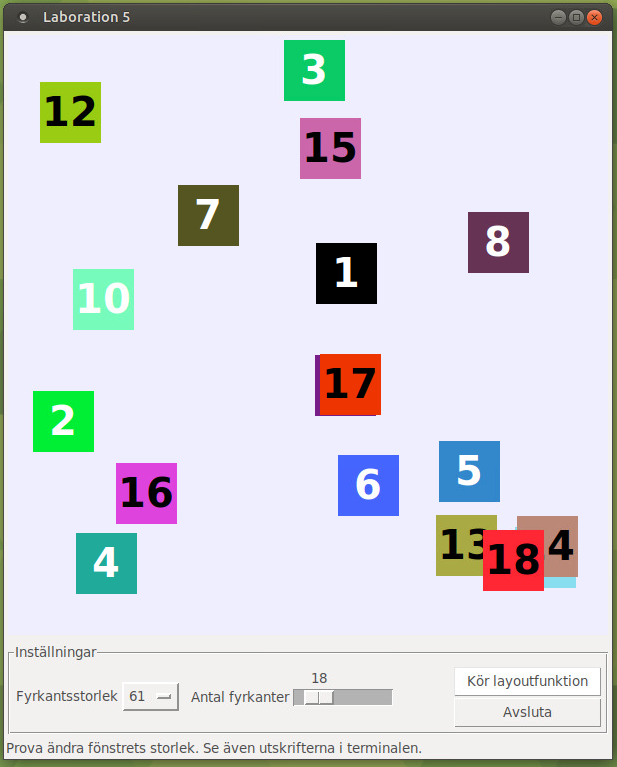

I denna del ska ni skriva funktioner som får in en lista med
`tkinter.Label`-objekt, samt höjd och bredd på den `tkinter.Frame` som de
placeras ut i. `tkinter.Label`-objekten ska placeras ut i sekvens, utan att
de nuddar varandra. Varje fyrkant ska synas helt och hållet.

I uppgift 1 placeras kvadraterna ut i rader. I uppgift 2 placeras kvadraterna ut
i kolumner.

## Krav på kommentarer och namngivning av funktioner och variabler

- Alla satser som består av fler än en rad ska ha en tillhörande kommentar. Dvs
  `if`-satser, loopar, funktioner och metoder. Kommentaren ska **inte** vara en
  "innantilläsning" av koden den hör till. Använd rätt kommentarsmarkering
  (t.ex. `"""` för funktions- metodkommentarer, `#` för kommentarer i löpande
  kod, se *PEP8* och *PEP257*).
- Funktioner och variabler ska vara döpta på ett bra sätt, dvs att de är
  beskrivande och reflekterar innehåll/funktion. Låt funktionsnamn vara verb och
  variabelnamn vara substantiv. Undvik namn på enbart en bokstav (var beredda
  att kunna motivera varför ni valt just det namnet).

Här är icke-godkänd kod:

```python
v = 0
q = 0
u = [19, 21, 24, 20]

# för alla element t, i listan, lägg till t till v
for t in u:
    v += t
q = v/len(u)
```

Här är en godkänd variant

```python
sum_age = 0
avg_age = 0
ages = [19, 21, 24, 20]

# räkna ut summan av alla åldrar
for age in ages:
    sum_age += age
avg_age = sum_age/len(ages)
```

## Försök att tänka på

- Minimera användningen av hårdkodade siffror, använd istället variabler
  med förklarande namn.
- Dela upp er kod i delfunktioner vid behov:
    - när ni stöter på kod som ni upprepar, bryt ut koden (lägg koden i en
      funktion)
    - skicka nödvändig information som argument till funktionen och låt den
      returnera eventuellt resultat, använd inte globala variabler
    - dela även upp er kod i fler funktioner när den blir för lång


## Kort om modulen tkinter


Modulen `tkinter` innehåller funktionalitet för att skapa grafiska gränssnitt. I
Del 2 har `tkinter` använts för att skapa det grafiska gränssnittet ni använder
för att testa er layout-funktion. Kvadraterna som placeras ut är instanser av
klassen `tkinter.Label`. Den yta som de placeras ut på är ett objekt av klassen
`tkinter.Frame`.


## Kodskelett

När ni ska börja koda hittar ni de filer som hör till labben i
`/kursmaterial/laboration5/del2`. Ett exempel på en algoritm som
placerar ut kvadraterna slumpmässigt hittar ni i `random-layout.py`. I den
ser ni hur en instans av klassen `lab5.LayoutTester` skapas och får
layoutfunktionen som ett argument.

- **DISTANSLÄGE**: Ladda ner filerna här: [lab5_del2.zip](files/lab5_del2.zip)

**OBS! Läs igenom `random-layout.py` och testkör den för att orientera er i
kodupplägget**.

Ni testkör den med:

``` bash
$ python3 random-layout.py
```

Koden till uppgiftens grafiska gränssnitt hittar ni i filen `lab5.py`. Ni
behöver inte ändra i den filen. Nedan ser ni hur gränssnittet ser ut och ett
exempel på en slumpmässig utplacering (oförändrad version av `random-layout.py`
har körts).




### Utplacering av kvadraterna (tkinter.Label-objekt)

```python
square.place(x=100, y=50)
```

I ovanstående exempel refererar variabeln `square` till en
`tkinter.Label`-instans. I exemplet används metoden `.place()` med de
namngivna argumenten `x` och `y` för att placera ut instansen 100 enheter
från den vänstra kanten och 50 enheter från den övre kanten. Placeringen av
en `Label` mäts från dess övre vänstra hörn. **Origo i koordinatsystemet
som används ligger alltså högst upp till vänster, med en y-axel som pekar
nedåt, och en x-axel som pekar åt höger.**


### Kvadraternas storlek

För att ta reda på hur hög en `tkinter`-widget är, kan man använda sig av
metoden `.winfo_height()`. För bredden använder man `.winfo_width()`. Om
`square1` ett `tkinter.Label`-objekt så får man dess bredd med
`square1.winfo_width()` och dess höjd med `square1.winfo_height()`.


## Uppgift 1 - görs av grupper med udda gruppsiffra


Skriv funktionen `row_layout` som placerar ut fyrkanterna radvis. Den första
fyrkanten placeras ut i det översta vänstra hörnet. Nästa fyrkant läggs till
*höger om* den första med ett förbestämt (välj själva) mellanrum mellan dem.
Algoritmen fortsätter så tills inga fler får plats på den raden. Nästa fyrkant
som placeras ut ska ligga *under* den första fyrkanten, d.v.s. på nästa rad.


### Specifika krav på utplaceringen

- Hela det tillgängliga utrymmet ska användas, dvs om fönstret görs större bör
  fler kvadrater få plats vid nästa körning av layout-funktionen (att bara ändra
  fönstrets storlek startar inte om utplaceringen).
- Ingen del av kvadraten ska placeras utanför fönstret (så att det inte syns).
- Om det finns fler kvadrater som ska placeras än vad som faktiskt får plats
  behöver endast de som får plats placeras ut.
- Kvadraterna placeras ut så att mitten på varje kvadrat är i linje med alla
  andra kvadrater på samma rad och samma kolumn.
- Er algoritm behöver endast hantera utplacering av kvadrater där alla är lika
  stora. Den gemensamma storleken för alla kvadrater kan dock variera.


### row_layout-funktionen

Er funktion `row_layout` ska alltså ersätta funktionen `random_layout` som finns
i kodskelettet och istället för att placera ut kvadraterna slumpmässigt, använda
den ovan beskrivna strategin.

En layout-funktion som ska fungera med testgränssnittet måste ta emot följande
argument:

- **`squares`**: Lista som innehåller `tkinter.Label`-objekt
- **`frame_height`**: Höjden (`int`) på den `Frame` som kvadraterna ligger i.
- **`frame_width`**: Bredden (`int`) på den `Frame` som kvadraterna ligger i.

När man trycker på knappen "Kör layoutfunktion" i gränssnittet körs skapas
kvadraterna som ska layoutas enligt inställningarna i gränssnittet, sen anropas
den layoutfunktion som angavs när gränssnittet när det skapades.

I det funktionsanropet skickar gränssnittet med listan av kvadrater, höjd
och bredd som ni har att jobba med.

**Det är alltså koden i filen `lab5.py` som anropar er funktion. Ni behöver inte
själva anropa den.**